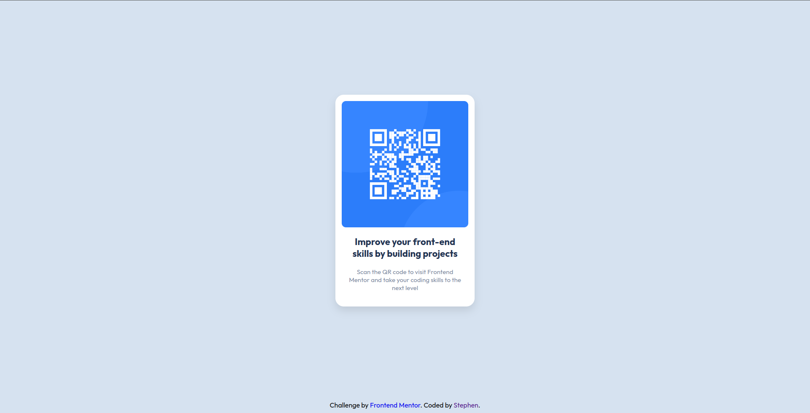

# Frontend Mentor - QR code component solution

This is a solution to the [QR code component challenge on Frontend Mentor](https://www.frontendmentor.io/challenges/qr-code-component-iux_sIO_H). Frontend Mentor challenges help you improve your coding skills by building realistic projects. 

## Table of contents

- [Overview](#overview)
  - [Screenshot](#screenshot)
  - [Links](#links)
- [My process](#my-process)
  - [Built with](#built-with)
  - [What I learned](#what-i-learned)
- [Author](#author)

## Overview

### Screenshot



### Links

- Solution URL: [Add solution URL here](https://github.com/steveoncaffeine/qr-code-component-main)
- Live Site URL: [Add live site URL here](https://steveoncaffeine.github.io/qr-code-component-main)

## My process

### Built with

- HTML
- CSS
- Flexbox

### What I learned

I used this project as an opportunity to make use of some best practices, such as safely setting the box-sizing of elements to border-box:

```css
*, *::before, *::before {
  box-sizing: inherit;
}
 html {
  box-sizing: border-box;
 }
```
And I also made use of flexbox which I recently learned. I learned how to initialize git repositories locally and how to move them to GitHub.
I also practiced drafting out my solution on paper before actually coding.

## Author

- Website - [Add your name here](https://steveoncaffeine.github.io)
- Frontend Mentor - [@yourusername](https://www.frontendmentor.io/profile/steveoncaffeine)
- Twitter - [@yourusername](https://www.twitter.com/steveoncaffeine)
